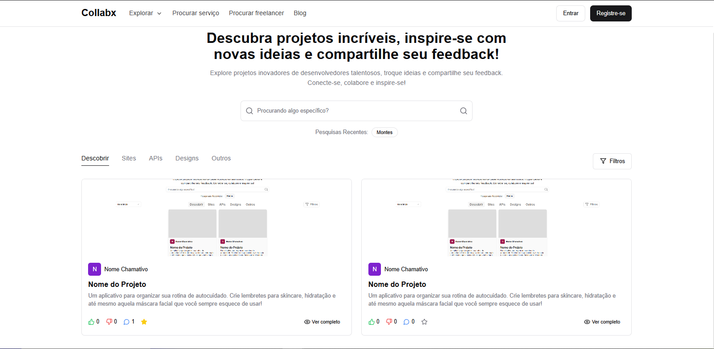

# Collbax - Frontend

Collbax é um rede social para gestão e colaboração em projetos. A aplicação permite criar, visualizar e interagir com projetos e perfis de usuários, proporcionando uma experiência rica em interações.

## 🚀 Tecnologias Utilizadas

- **RemixJS** - Framework para o frontend
- **Axios** - Requisições HTTP para comunicação com a API
- **TailwindCSS** - Estilização e design responsivo
- **Zustand** - Gerenciamento de estado
- **React Hook Form** - Gerenciamento de formulários

## ✅ Checklist de Funcionalidades

| Funcionalidade       | Status |
|----------------------|--------|
| **Projetos**        |        |
| Exibição            | ✅      |
| Edição              | 💻     |
| Pesquisa            | ⏳     |
| Classificação por tags | ⏳  |
| Inteligência de exibição | ⏳ |
| **Comentários**     |        |
| Comentar           | ✅      |
| Curtir comentários | ✅      |
| Responder comentários | ✅   |
| Curtir respostas   | ✅      |
| **Perfis de Usuários** |     |
| Visualização       | ✅      |
| Edição             | 💻     |
| Sistema de follow  | ⏳     |
| **Notificações**   |        |
| E-mail             | ⏳     |
| WhatsApp           | ⏳     |

✅ - Concluído | 💻 - Em desenvolvimento | ⏳ - Planejado

## 📷 Demonstração

## 📌 Como Contribuir

Se deseja contribuir para o desenvolvimento do Collbax, sinta-se à vontade para abrir uma issue ou enviar um pull request.

## ✒️ Autor

Desenvolvido por **[Kaynan Wallen](https://github.com/KaynanWallen)**

## 📄 Licença

Este projeto está sob a licença MIT - veja o arquivo [LICENSE](https://github.com/KaynanWallen) para mais detalhes.

---

Este README será atualizado conforme o progresso do desenvolvimento do Collbax. 🚀

